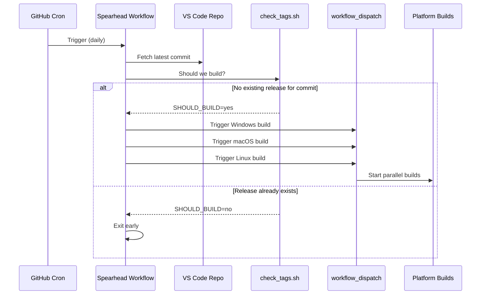

# CI/CD Workflows

CodeSphere IDE uses a sophisticated multi-platform build system orchestrated through GitHub Actions. This document explains the build matrix, workflow triggers, and the "Spearhead" pattern.

## Build Matrix Overview

### Build Qualities

CodeSphere produces two release channels:

- **Stable**: Tracks official VS Code stable releases
- **Insider**: Tracks VS Code insider (nightly) builds

### Supported Platforms

Each quality is built for three platforms:

- **Windows** (x64, arm64)
- **macOS** (x64, arm64)
- **Linux** (x64, arm64, armhf, riscv64)

### Workflow Files

```
.github/workflows/
├── insider-windows.yml
├── insider-macos.yml
├── insider-linux.yml
├── insider-spearhead.yml
├── stable-windows.yml
├── stable-macos.yml
├── stable-linux.yml
└── stable-spearhead.yml
```

## The Spearhead Pattern

### What is Spearhead?

The **Spearhead** workflow is an orchestrator that:

1. Checks for new upstream VS Code commits
2. Determines if a build is needed via `check_tags.sh`
3. Dispatches platform-specific builds if required
4. Creates GitHub releases with metadata

### Spearhead Workflow



### Key Scripts

#### `check_tags.sh`

Determines if a build is necessary by:
- Fetching the latest release from the repository
- Comparing it to the upstream VS Code commit hash
- Returning `SHOULD_BUILD=yes` if no matching release exists

> **Fixed Issue**: Now handles initial builds where no releases exist yet.

#### `get_repo.sh`

Fetches the VS Code source code:
- Clones the microsoft/vscode repository
- Checks out the specific commit or tag
- Applies CodeSphere-specific patches

## Workflow Triggers

### Branch Strategy

All workflows trigger on:
- **`push`** to `main` branch
- **`schedule`**: Daily cron for insider, less frequent for stable
- **`workflow_dispatch`**: Manual triggers

### Environment Variables

Key environment variables set by spearhead:

```yaml
env:
  GITHUB_BRANCH: ${{ github.ref_name }}
  MS_COMMIT: <upstream-commit-hash>
  MS_TAG: <upstream-tag>
  RELEASE_VERSION: <version-string>
  SHOULD_BUILD: yes|no
  SHOULD_DEPLOY: yes|no
```

## Build Process Flow

### 1. Checkout & Setup
```bash
- uses: actions/checkout@v4
  with:
    ref: ${{ github.ref_name }}
```

### 2. Dependency Installation
- Node.js version from `.nvmrc`
- Python for build tools
- Platform-specific SDKs (Visual Studio, Xcode, etc.)

### 3. Source Preparation
```bash
./get_repo.sh          # Clone VS Code
./prepare_vscode.sh    # Apply patches and rebranding
```

### 4. Build
```bash
./build.sh            # Main application build
./build_cli.sh        # CLI (code command)
```

### 5. Packaging
- **Windows**: MSI installer via WiX toolset
- **macOS**: DMG and ZIP packages
- **Linux**: DEB, RPM, AppImage, Snap, tar.gz

### 6. Signing
- **Windows**: SignPath.io for Authenticode signatures
- **macOS**: Apple Developer ID + Notarization
- **Linux**: GPG signatures

### 7. Release
```bash
./release.sh          # Upload to GitHub Releases
```

## Platform-Specific Details

### Windows Build

**MSI Installer**:
- Built with WiX Toolset
- Configurable via `DISABLE_INSIDER_MSI` flag
- Includes auto-update functionality

**Signing**:
- SignPath API for automated code signing
- Supports both System and User MSI installers

### macOS Build

**Notarization**:
- Requires Apple Developer credentials
- Uses `notarytool` for submission
- Staples notarization ticket to DMG

**Universal Binaries**:
- Separate builds for x64 and arm64
- Combined into universal app when both succeed

### Linux Build

**Multi-Format Support**:
- Native DEB/RPM packages
- AppImage for distribution-agnostic installs
- Snap for confined environments
- Tarball for manual installation

## Debugging Builds

### Common Issues

1. **Checkout Failures**
   - Ensure `GITHUB_BRANCH` is set correctly
   - Verify branch exists in repository

2. **"can't check assets" Error**
   - Fixed: Now handles empty release repositories
   - Check `ASSETS_REPOSITORY` environment variable

3. **Version Regex Failures**
   - Fixed: Relaxed regex to support all patch versions
   - Pattern: `^([0-9]+\.[0-9]+\.[0-9]+)` (was `[0-5]`)

### Monitoring Builds

View workflow runs:
```
https://github.com/<org>/codesphere-IDE/actions
```

Filter by workflow:
- `insider-spearhead.yml`
- `stable-macos.yml`
- etc.

## Extending the Build System

### Adding a New Platform

1. Create workflow file: `.github/workflows/insider-<platform>.yml`
2. Add build scripts in `build/<platform>/`
3. Update spearhead to dispatch to new workflow
4. Test with `SHOULD_BUILD=yes`

### Modifying Build Steps

Edit platform-specific workflow:
- Ensure idempotency for workflow restarts
- Use caching for node_modules and dependencies
- Set proper failure handling

## References

- [GitHub Actions Documentation](https://docs.github.com/en/actions)
- [VS Code Build Guide](https://github.com/microsoft/vscode/wiki/How-to-Contribute#build-and-run)
- [WiX Toolset](https://wixtoolset.org/)
- [SignPath Documentation](https://about.signpath.io/documentation/)
