# CI/CD Architecture

Detailed technical architecture of the CodeSphere IDE continuous integration and delivery system.

## System Overview

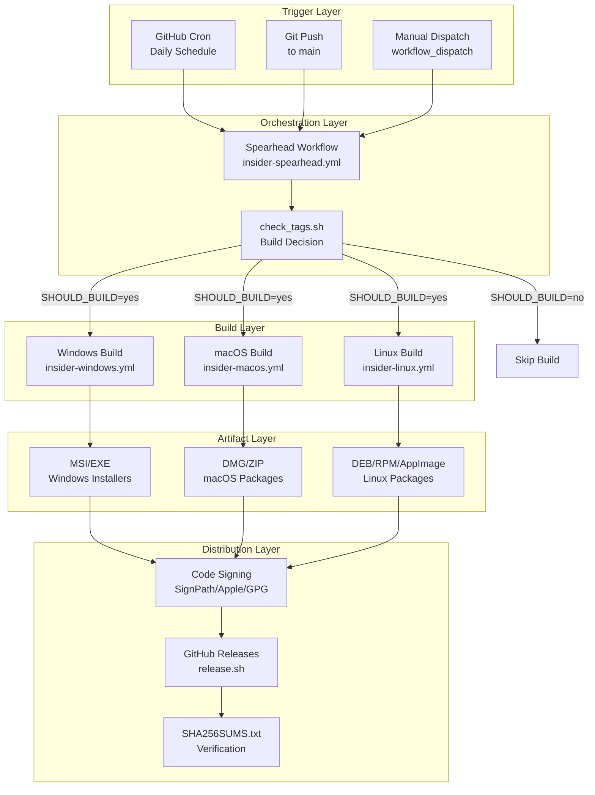

## Build Matrix Architecture

### Multi-Dimensional Matrix

CodeSphere uses a **3D build matrix**:

1. **Quality** (2 options):
   - Stable
   - Insider

2. **Platform** (3 options):
   - Windows
   - macOS
   - Linux

3. **Architecture** (varies by platform):
   - Windows: x64, arm64
   - macOS: x64, arm64 (universal binary)
   - Linux: x64, arm64, armhf, riscv64

**Total combinations**: ~24 unique builds per release

### Matrix Visualization

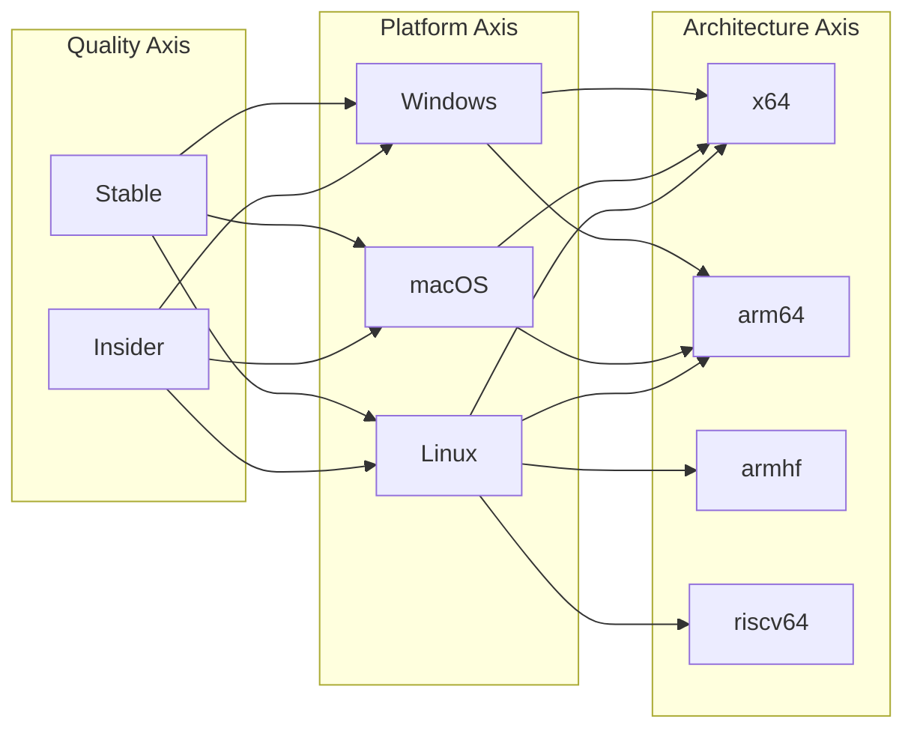

## Spearhead Orchestrator Pattern

### Decision Flow

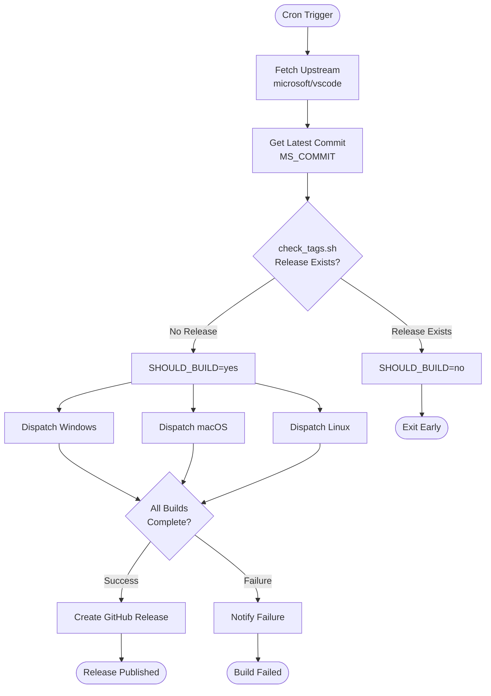

### Environment Variable Flow

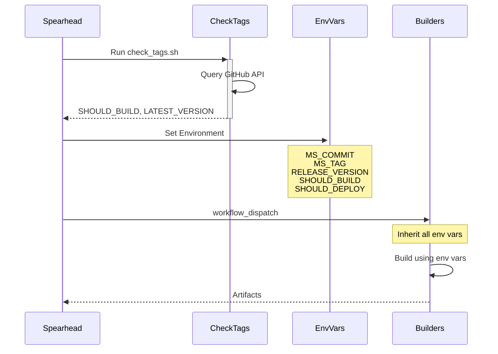

## Platform Build Pipelines

### Windows Pipeline

```mermaid
flowchart LR
    START([Windows Workflow]) --> SETUP[Setup Environment<br/>Visual Studio<br/>Node.js<br/>Python]
    SETUP --> CHECKOUT[Checkout Code<br/>actions/checkout@v4]
    CHECKOUT --> GET_REPO[get_repo.sh<br/>Clone VS Code]
    GET_REPO --> PREPARE[prepare_vscode.sh<br/>Apply Patches<br/>Rebrand]
    PREPARE --> BUILD[build.sh<br/>Compile TypeScript<br/>Bundle Webpack]
    BUILD --> BUILD_CLI[build_cli.sh<br/>Build CLI Tool]
    BUILD_CLI --> PACKAGE_USER[Package User Installer<br/>Inno Setup]
    PACKAGE_USER --> PACKAGE_SYSTEM[Package System Installer<br/>WiX MSI]
    PACKAGE_SYSTEM --> SIGN{Sign Binaries?}
    SIGN -->|Yes| SIGNPATH[SignPath API<br/>Authenticode]
    SIGN -->|No| UPLOAD
    SIGNPATH --> UPLOAD[Upload Artifacts<br/>GitHub Actions]
    UPLOAD --> END([Complete])
```

### macOS Pipeline

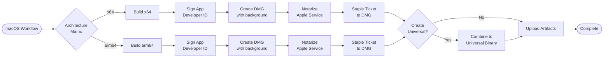

### Linux Pipeline

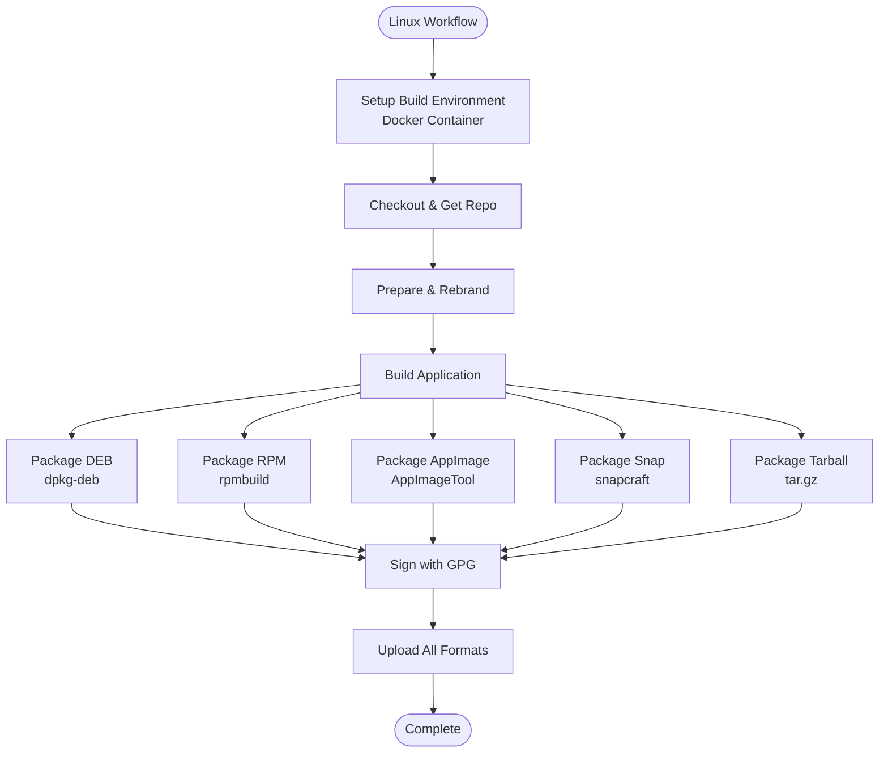

## Signing Architecture

### Windows Code Signing Flow

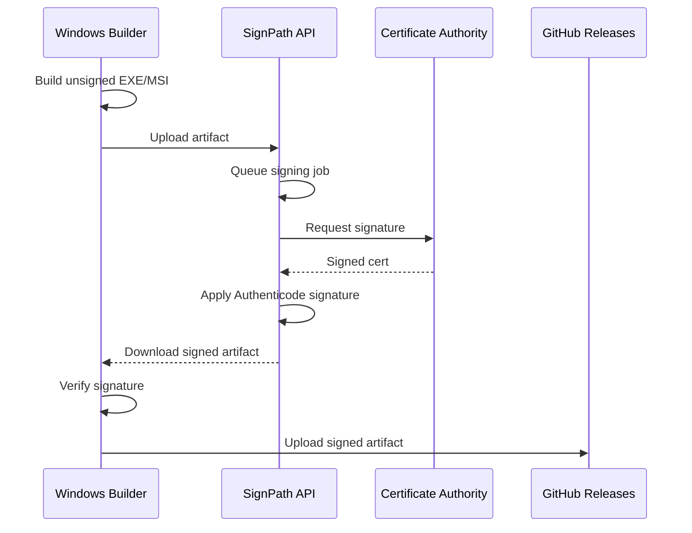

### macOS Notarization Flow

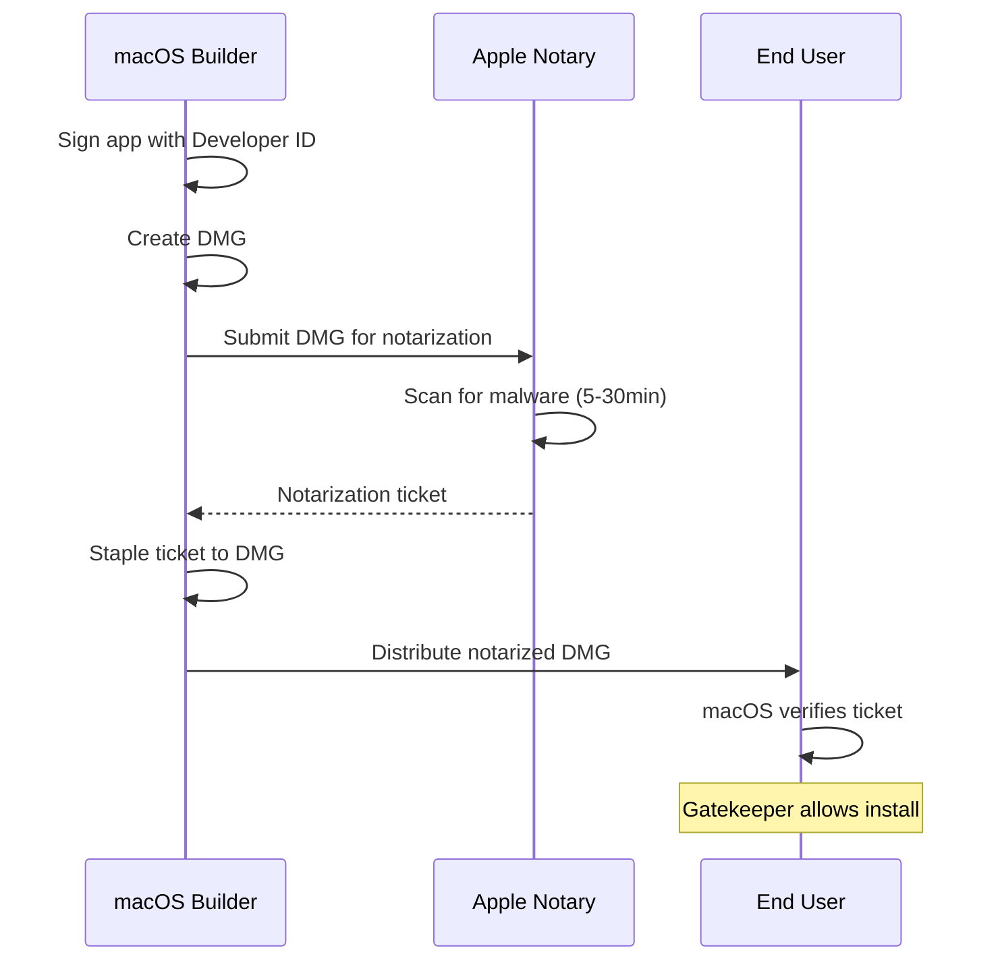

## Caching Strategy

### Node Modules Cache

```yaml
- uses: actions/cache@v3
  with:
    path: |
      ~/.npm
      vscode/node_modules
    key: ${{ runner.os }}-node-${{ hashFiles('vscode/package-lock.json') }}
    restore-keys: |
      ${{ runner.os }}-node-
```

### Build Cache

```yaml
- uses: actions/cache@v3
  with:
    path: |
      vscode/.build
      vscode/out
    key: ${{ runner.os }}-build-${{ github.sha }}
    restore-keys: |
      ${{ runner.os }}-build-
```

## Failure Handling

### Retry Logic

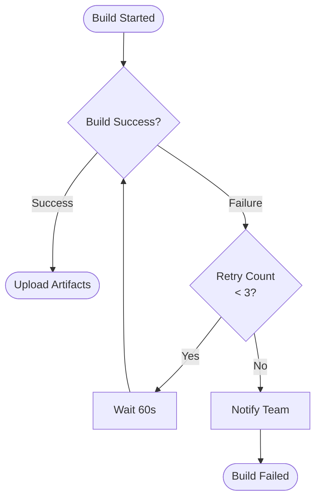

### Partial Build Recovery

If one platform fails:

1. **Other platforms continue**: Builds are independent
2. **Spearhead marks partial**: `PARTIAL_BUILD=yes`
3. **Manual trigger available**: Re-run failed platform only

## Performance Optimizations

### Parallel Execution

```mermaid
gantt
    title Build Parallelization
    dateFormat HH:mm
    section Platforms
    Windows Build    :a1, 00:00, 45m
    macOS Build      :a2, 00:00, 60m
    Linux Build      :a3, 00:00, 40m
    section Signing
    Windows Sign     :after a1, 5m
    macOS Notarize   :after a2, 15m
    Linux Sign       :after a3, 2m
    section Release
    Create Release   :milestone, after a1 a2 a3, 0m
```

**Total Time**: ~75 minutes (parallelized) vs ~145 minutes (sequential)

### Build Cache Hit Rate

| Cache Type | Typical Hit Rate | Time Saved |
|------------|------------------|------------|
| Node Modules | 85% | ~10 minutes |
| TypeScript Build | 60% | ~5 minutes |
| Webpack Bundle | 40% | ~3 minutes |

## Monitoring & Observability

### Metrics Tracked

1. **Build Duration**: Per platform, per step
2. **Cache Hit Rates**: npm, build output
3. **Failure Rates**: By platform, by error type
4. **Artifact Sizes**: Trend over time

### Alerts

- Build failure notification via GitHub Actions
- Long-running builds (>2 hours)
- Signing failures
- Artifact upload failures

## Security Considerations

### Secret Management

```yaml
secrets:
  SIGNPATH_API_TOKEN:
    required: true
    description: SignPath API key for Windows signing
  
  APPLE_ID:
    required: true
    description: Apple Developer account for notarization
  
  GPG_PRIVATE_KEY:
    required: true
    description: GPG key for Linux package signing
```

### Artifact Verification

```bash
# Windows
Get-AuthenticodeSignature CodeSphere.exe

# macOS
spctl -a -vvv CodeSphere.dmg

# Linux
gpg --verify CodeSphere.deb.asc
```

## Disaster Recovery

### Rollback Procedure

1. **Unpublish release** via GitHub API
2. **Delete release tag**
3. **Re-run previous build** if needed
4. **Communicate** via GitHub Discussions

### Backup Strategy

- **Source code**: Multiple git remotes
- **Build artifacts**: Retained for 90 days
- **Signing certificates**: Stored in secure vault

## Future Improvements

### Planned

- [ ] Matrix builds for all architectures simultaneously
- [ ] Self-hosted runners for faster builds
- [ ] Artifact caching across workflows
- [ ] Automated rollback on critical failures

### Under Consideration

- [ ] Blue-green deployment strategy
- [ ] Canary releases for insiders
- [ ] A/B testing framework
- [ ] Automated performance regression detection

## References

- [GitHub Actions Documentation](https://docs.github.com/en/actions)
- [SignPath Integration Guide](https://about.signpath.io/documentation/build-system-integration)
- [Apple Notarization](https://developer.apple.com/documentation/security/notarizing_macos_software_before_distribution)
- [Semantic Release](https://semantic-release.gitbook.io/)
