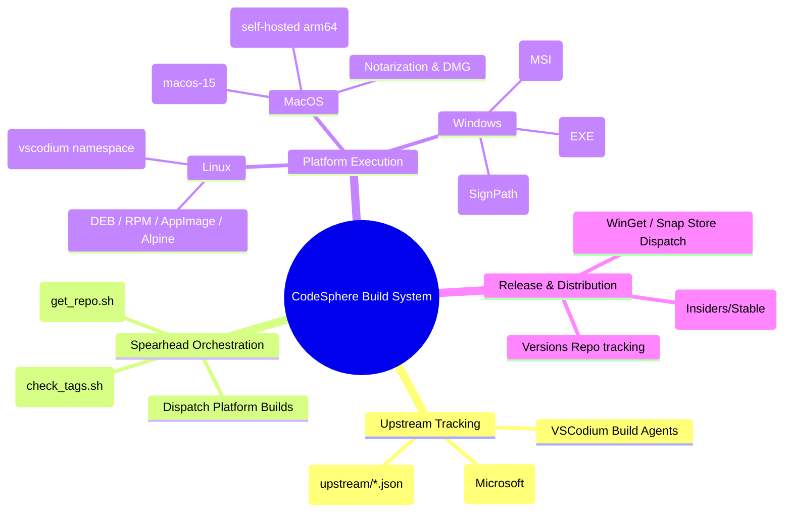
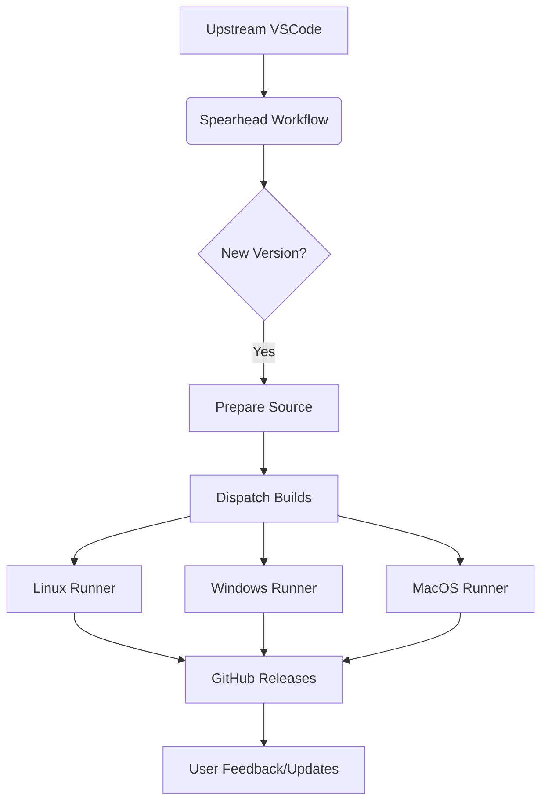
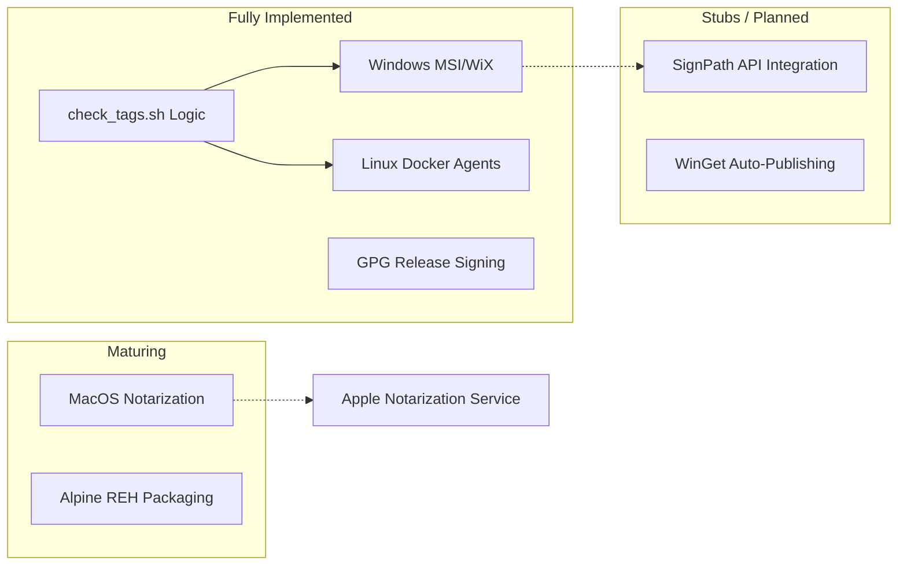

# Architecture Diagrams

## Build System Mind Map

This diagram visualizes the end-to-to workflow of the CodeSphere build pipeline, from upstream tracking to artifact release.

## Component Interconnection

## Component Implementation State

This diagram highlights which parts of the system are currently operational and which are awaiting further development (stubs).

