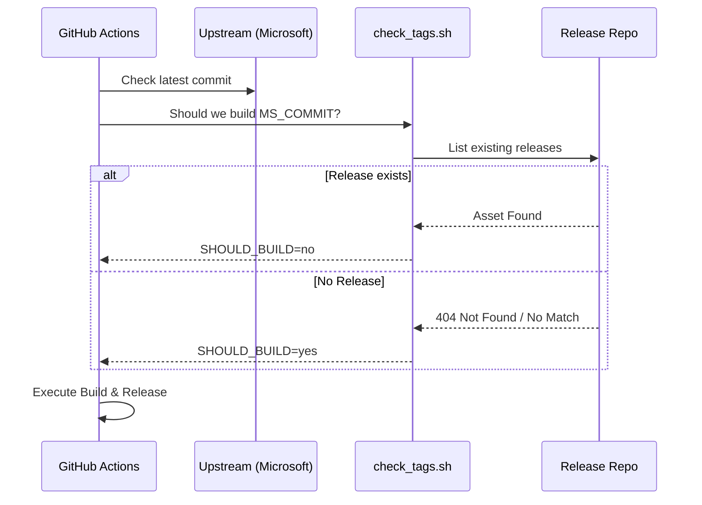

# Software Requirements Specification (SRS) - CodeSphere IDE

## 1. Introduction
CodeSphere IDE is a custom distribution of VSCodium, rebranded for the **System Zero** ecosystem. This document outlines the functional and non-functional requirements for its build system, rebranding logic, and distribution pipeline.

## 2. Project Goals
1. Provide a completely rebranded vector for Code editing (System Zero identity).
2. Automate the tracking and fetching of upstream VS Code / VSCodium updates.
3. Produce signed, multi-platform binaries (Windows, Linux, MacOS) with minimal manual intervention.
4. Integrate seamlessly with the System Zero "The Operator" and other architectural components.

## 3. Functional Requirements

### 3.1. Rebranding & Asset Management
*   **FR-001**: The system shall replace all Microsoft/VS Code branding with CodeSphere assets.
*   **FR-002**: The system shall update metadata, including application name, publisher, and standard product URLs.
*   **FR-003**: The environment shall support high-resolution icon generation (ICO, ICNS, PNG) from a single source SVG.

### 3.2. Build Orchestration (Spearhead)
*   **FR-004**: The system shall detect new versions from upstream VS Code via API polling.
*   **FR-005**: The system shall handle "Initial Build" scenarios where no previous releases exist in the target repository.
*   **FR-006**: The system shall dispatch build triggers to specialized platform workers (Linux, Windows, MacOS).

### 3.3. Distribution & Signing
*   **FR-007**: Windows builds shall be packaged as MSI installers using the WiX toolset.
*   **FR-008**: Release artifacts shall be signed using GPG keys for authenticity.
*   **FR-009**: The system shall support SignPath integration for automated Windows binary signing (Stubbed).
*   **FR-010**: MacOS builds shall be signed and notarized via Apple's Notarization Service (Maturing).

## 4. Non-Functional Requirements
1. **Reproducibility**: Builds must be consistent when run on the same Docker build agent image.
2. **Observability**: Build logs must be accessible and provide clear errors for failures (e.g., "can't check assets").
3. **Portability**: Design documentation must be servable locally with automated port conflict resolution.
4. **Resilience**: The build scripts must handle API rate limits and network flakiness gracefully.

## 5. Use Case: Build Lifecycle

