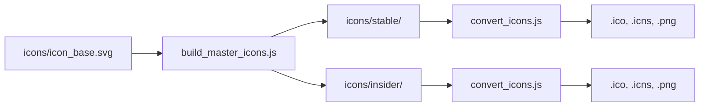

# Rebranding Guide

CodeSphere IDE is a complete rebrand of VS Code with custom branding, telemetry removal, and System Zero ecosystem integration. This guide explains the rebranding process and scripts.

## Overview

The rebranding process transforms Microsoft VS Code into CodeSphere by:

1. **Replacing Visual Assets**: Icons, logos, and splash screens
2. **Updating Metadata**: Product names, publisher info, and URLs
3. **Modifying Configuration**: Telemetry settings and marketplace endpoints
4. **Applying Patches**: Custom modifications via patch files

## Rebranding Scripts

### `prepare_vscode.sh`

The main rebranding orchestrator that calls all other preparation scripts:

```bash
./prepare_vscode.sh
```

**What it does**:
- Applies all patches from `patches/` directory
- Runs `prepare_assets.sh` for icon replacement
- Modifies `product.json` with CodeSphere metadata
- Disables telemetry via `undo_telemetry.sh`
- Updates URLs and branding strings

### `mass_rebrand.ps1`

PowerShell script for comprehensive text-based rebranding:

```powershell
.\mass_rebrand.ps1
```

**Features**:
- Search and replace "Visual Studio Code" → "CodeSphere"
- Updates all JSON, TypeScript, and configuration files
- Handles case-sensitive replacements
- Generates rebrand log for verification

**Key Replacements**:
```powershell
"Visual Studio Code" → "Code Sphere"
"vscode" → "codesphere"
"Microsoft Corporation" → "System Zero"
```

### `mass_rebrand_nuclear.ps1`

Aggressive rebrand variant that includes:
- All base rebranding from `mass_rebrand.ps1`
- Additional deep file system changes
- Icon file name transformations

> **⚠️ Warning**: This script makes irreversible changes. Always commit before running.

### `mass_rebrand_super.ps1`

Extended rebrand with marketplace and extension changes:
- Modifies extension gallery URLs
- Updates marketplace endpoints
- Changes update server URLs
- Replaces Microsoft service endpoints

## Icon & Asset Pipeline

### Icon Generation Flow



### `build_master_icons.js`

Generates PNG icons at various sizes from SVG source:

```bash
node build_master_icons.js
```

**Outputs**:
- `icons/stable/codesphere_*.png` (16x16 to 512x512)
- `icons/insider/codesphere_*.png` (with insider badge)

**SVG Requirements**:
- Base file: `icons/icon_base.svg`
- Viewbox: `0 0 512 512` recommended
- Clean paths (no text objects)

### `convert_icons.js`

Converts PNG icons to platform-specific formats:

```bash
node convert_icons.js
```

**Platform Formats**:
- **Windows**: `.ico` (multi-resolution ICO files)
- **macOS**: `.icns` (Apple Icon Image format)
- **Linux**: `.png` (various sizes)

**Dependencies**:
- `imagemagick` for ICO conversion
- `iconutil` (macOS) for ICNS creation
- `png2icns` (Linux) for ICNS on non-Mac systems

### `prepare_assets.sh`

Copies generated icons into VS Code source tree:

```bash
./prepare_assets.sh
```

**Replacements**:
```
src/vs/resources/win32/code.ico
src/vs/resources/darwin/code.icns
resources/linux/code.png
```

## Product Configuration

### `product.json`

Central configuration file defining product identity:

```json
{
  "nameShort": "CodeSphere",
  "nameLong": "CodeSphere IDE",
  "applicationName": "codesphere",
  "win32AppId": "{unique-guid}",
  "darwinBundleIdentifier": "com.systemzero.codesphere",
  
  "extensionsGallery": {
    "serviceUrl": "https://open-vsx.org/vscode/gallery",
    "itemUrl": "https://open-vsx.org/vscode/item"
  },
  
  "linkProtectionTrustedDomains": [
    "https://open-vsx.org"
  ],
  
  "enableTelemetry": false,
  "quality": "stable"
}
```

**Key Fields**:
- `nameShort/nameLong`: Display names
- `applicationName`: Binary and directory names
- `win32AppId`: Windows installer GUID
- `darwinBundleIdentifier`: macOS bundle ID
- `extensionsGallery`: Marketplace endpoint (OpenVSX)

### GUIDs and Identifiers

**Windows MSI GUIDs** (`guids.txt`):
```
ProductCode: {GUID-1}
UpgradeCode: {GUID-2}
```

> **⚠️ Important**: Never change `UpgradeCode` after first release. This ensures proper upgrade detection.

**macOS Bundle ID**:
```
com.systemzero.codesphere
com.systemzero.codesphere.helper
```

## Patch System

### Patch Directory Structure

```
patches/
├── telemetry-disable.patch
├── marketplace-openvsx.patch
├── branding-strings.patch
└── ...61 patches total
```

### Creating a New Patch

1. **Initialize patch creation**:
```bash
./dev/patch.sh my-feature-name
```

2. **Make changes in `vscode/` directory**:
```bash
cd vscode
npm run watch      # Terminal 1
./scripts/code.sh  # Terminal 2 - test changes
```

3. **Complete the patch**:
   - Press any key when prompted
   - Patch is saved to `patches/my-feature-name.patch`

### Applying Patches

Patches are automatically applied by `prepare_vscode.sh`:

```bash
for patch in patches/*.patch; do
  git apply "$patch"
done
```

### Updating Existing Patches

See [Patch System Documentation](./patch-system.md) for the semi-automated update process.

## Telemetry Removal

### `undo_telemetry.sh`

Disables all Microsoft telemetry and tracking:

```bash
./undo_telemetry.sh
```

**Actions**:
- Sets `enableTelemetry: false` in `product.json`
- Removes ApplicationInsights SDK imports
- Strips crash reporter configuration
- Disables update notifications for Microsoft endpoints

### Verification

After rebranding, verify telemetry removal:

```bash
# Search for remaining telemetry calls
grep -r "appInsights" src/ || echo "Clean!"
grep -r "telemetry" product.json
```

## URL Replacements

### Service Endpoints

| Service | Microsoft | CodeSphere |
|---------|-----------|------------|
| Marketplace | `marketplace.visualstudio.com` | `open-vsx.org` |
| Update Server | `update.code.visualstudio.com` | `github.com/.../releases` |
| Docs | `code.visualstudio.com/docs` | `github.com/.../docs` |
| Download | `code.visualstudio.com/download` | `github.com/.../releases` |

### Link Protection

Trusted domains for link protection:
```json
"linkProtectionTrustedDomains": [
  "https://open-vsx.org",
  "https://github.com"
]
```

## Build-Time Asset Replacement

### Windows Specific

**MSI Resources**:
```
build/win32/code.ico        → Installer icon
build/win32/banner.bmp      → MSI banner image
build/win32/dialog.bmp      → MSI dialog background
```

Generated by `gen_bmp.ps1`:
```powershell
.\gen_bmp.ps1
```

### macOS Specific

**DMG Background**:
```
build/darwin/background.png → DMG background image
```

**App Icon**:
```
resources/darwin/code.icns
```

## Testing Rebranding

### Visual Verification

1. **Build and run**:
```bash
./build.sh
cd vscode
./scripts/code.sh
```

2. **Check branding**:
   - Window title should be "CodeSphere"
   - About dialog should show System Zero
   - Icons should be custom

### Automated Checks

```bash
# Verify no Microsoft branding in binaries
strings vscode/out/*/code | grep -i "microsoft"

# Check product.json
cat vscode/product.json | grep nameShort

# Verify icon files exist
ls -lh icons/stable/*.png
```

## Troubleshooting

### Icons Not Updating

**Symptom**: Old VS Code icons still show after build

**Solution**:
```bash
# Clean icon cache
rm -rf ~/.cache/icon-cache/*  # Linux
rm -rf ~/Library/Caches/com.apple.iconservices.store  # macOS

# Rebuild icons
node build_master_icons.js
node convert_icons.js
./prepare_assets.sh
```

### Patch Failures

**Symptom**: `git apply` fails during `prepare_vscode.sh`

**Solution**:
```bash
# Check which patch failed
git apply --check patches/*.patch

# Apply manually
cd vscode
git apply --3way ../patches/failing-patch.patch

# Resolve conflicts and update patch
```

### Missed Rebranding

**Symptom**: Some UI strings still say "Visual Studio Code"

**Solution**:
```bash
# Find occurrences
grep -r "Visual Studio Code" vscode/src/

# Add to mass_rebrand.ps1 or create patch
```

## Best Practices

1. **Always commit before rebranding**: Changes are extensive
2. **Test all platforms**: Icons render differently
3. **Verify marketplace**: Ensure extensions install from OpenVSX
4. **Check telemetry**: Use network monitor during development
5. **Document custom patches**: Explain why each patch exists

## References

- [VS Code Build Guide](https://github.com/microsoft/vscode/wiki/How-to-Contribute)
- [OpenVSX Registry](https://open-vsx.org/)
- [WiX Toolset Documentation](https://wixtoolset.org/)
- [Apple Notarization Guide](https://developer.apple.com/documentation/security/notarizing_macos_software_before_distribution)
