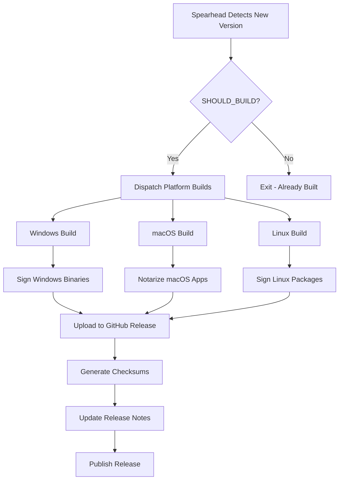

# Release Process

This document describes the complete release workflow for CodeSphere IDE, from upstream tracking to published binaries.

## Release Cadence

### Stable Releases

**Frequency**: Monthly (following VS Code stable releases)

**Trigger**: New VS Code stable tag (e.g., `1.85.0`)

**Timeline**:
```
Day 1: VS Code stable release
Day 1-2: Spearhead detects new version
Day 2-3: Platform builds complete
Day 3: Release published
```

### Insider Releases

**Frequency**: Daily

**Trigger**: New commits to VS Code `main` branch

**Timeline**:
```
00:00 UTC: Spearhead cron trigger
00:05 UTC: Build dispatched if new commit
02:00 UTC: Release published (typical)
```

## Release Workflow Overview



## Version Management

### Version Format

**Stable**:
```
<VS Code Version>.<Build Number>
Example: 1.85.0.2401234
```

**Insider**:
```
<VS Code Version>.<Timestamp>-insider
Example: 1.86.0.20240115-insider
```

### `update_version.sh`

Determines the release version based on upstream VS Code:

```bash
./update_version.sh
```

**Logic**:
1. Read VS Code version from `package.json`
2. Append build timestamp or build number
3. Set `RELEASE_VERSION` environment variable

### `version.sh`

Simple helper to extract version components:

```bash
source ./version.sh
echo $RELEASE_VERSION
echo $MS_TAG
echo $MS_COMMIT
```

## Build Artifacts

### Per-Platform Artifacts

#### Windows

| Artifact | Format | Purpose |
|----------|--------|---------|
| User Installer | `.exe` | Per-user installation |
| System Installer | `.exe` | System-wide installation |
| User MSI | `.msi` | Enterprise deployment (user) |
| System MSI | `.msi` | Enterprise deployment (system) |
| ZIP Archive | `.zip` | Portable version |
| ARM64 variants | Same as above | ARM Windows support |

#### macOS

| Artifact | Format | Purpose |
|----------|--------|---------|
| DMG Image | `.dmg` | Standard macOS installer |
| ZIP Archive | `.zip` | Direct app distribution |
| Universal Binary | Both above | x64 + arm64 combined |
| CLI Archive | `.tar.gz` | Command-line tools |

#### Linux

| Artifact | Format | Purpose |
|----------|--------|---------|
| Debian Package | `.deb` | Ubuntu, Debian, Mint |
| RPM Package | `.rpm` | Fedora, RHEL, openSUSE |
| AppImage | `.AppImage` | Universal Linux binary |
| Snap Package | `.snap` | Snap Store distribution |
| TAR Archive | `.tar.gz` | Manual installation |
| ARM variants | All above formats | ARM Linux support |

### Checksums

Generated by `prepare_checksums.sh`:

```bash
./prepare_checksums.sh
```

**Output**: `SHA256SUMS.txt`

```
a1b2c3... CodeSphere-Setup-1.85.0.exe
d4e5f6... CodeSphere-1.85.0.dmg
...
```

## Signing & Verification

### Windows Code Signing

**Provider**: [SignPath.io](https://signpath.io/)

**Process**:
1. Upload unsigned artifacts to SignPath API
2. Await signing completion (automated)
3. Download signed artifacts
4. Verify Authenticode signature

**Configuration** (in workflow):
```yaml
env:
  SIGNPATH_API_TOKEN: ${{ secrets.SIGNPATH_API_TOKEN }}
  SIGNPATH_ORGANIZATION_ID: ${{ secrets.SIGNPATH_ORGANIZATION_ID }}
  SIGNPATH_PROJECT_SLUG: "codesphere"
  SIGNPATH_POLICY_SLUG: "release-signing"
```

**Verification**:
```powershell
# Check signature
Get-AuthenticodeSignature .\CodeSphere-Setup.exe

# Should show:
# Status: Valid
# SignerCertificate: CN=SignPath Foundation
```

### macOS Notarization

**Provider**: Apple Developer

**Process**:
1. Sign application with Developer ID
2. Create DMG with signed app
3. Submit DMG to Apple notarization service
4. Wait for ticket (5-30 minutes)
5. Staple ticket to DMG

**Commands** (in `build.sh`):
```bash
# Sign
codesign --sign "Developer ID Application" CodeSphere.app

# Notarize
xcrun notarytool submit CodeSphere.dmg \
  --apple-id "$APPLE_ID" \
  --team-id "$TEAM_ID" \
  --password "$APP_PASSWORD" \
  --wait

# Staple
xcrun stapler staple CodeSphere.dmg
```

**Verification**:
```bash
# Check notarization
spctl -a -vvv -t install CodeSphere.dmg

# Should show: accepted
# source=Notarized Developer ID
```

### Linux Package Signing

**Method**: GPG signatures

**Process**:
```bash
# Sign all artifacts
for file in *.{deb,rpm,tar.gz,AppImage}; do
  gpg --detach-sign --armor "$file"
done
```

**Verification**:
```bash
# Verify signature
gpg --verify CodeSphere-1.85.0.deb.asc CodeSphere-1.85.0.deb
```

## Release Publishing

### `release.sh`

Main release script that uploads artifacts to GitHub Releases:

```bash
./release.sh
```

**Steps**:
1. Verify all artifacts exist
2. Generate checksums
3. Create or update GitHub release
4. Upload all artifacts
5. Upload checksum file
6. Set release as latest (stable) or prerelease (insider)

**Environment Variables**:
```bash
RELEASE_VERSION="1.85.0.2401234"
MS_TAG="1.85.0"
MS_COMMIT="abc123def456"
GITHUB_TOKEN="${{ secrets.GITHUB_TOKEN }}"
```

### GitHub Release API

Using `gh` CLI:

```bash
# Create release
gh release create "$RELEASE_VERSION" \
  --title "CodeSphere $RELEASE_VERSION" \
  --notes-file release_notes.md \
  --repo CodeSphere/codesphere-IDE

# Upload artifacts
gh release upload "$RELEASE_VERSION" *.{exe,msi,dmg,deb,rpm,AppImage,tar.gz,snap}
```

### Release Notes

**Generated from**: `release_notes.md`

**Template**:
```markdown
## CodeSphere IDE v${RELEASE_VERSION}

### Based on VS Code ${MS_TAG}

This release tracks [VS Code ${MS_TAG}](https://github.com/microsoft/vscode/releases/tag/${MS_TAG}).

### CodeSphere-Specific Changes

- Telemetry fully removed
- OpenVSX marketplace integration
- System Zero branding

### Download

Platform-specific download links...

### Checksums

See [SHA256SUMS.txt](./SHA256SUMS.txt)
```

## Upstream Tracking

### `update_upstream.sh`

Fetches latest VS Code changes:

```bash
./update_upstream.sh
```

**Actions**:
1. Fetch microsoft/vscode repository
2. Determine latest stable tag or commit
3. Update local references
4. Trigger spearhead if needed

### Sync Strategy

**Stable Branch**:
- Track tags: `1.85.0`, `1.86.0`, etc.
- Only build on new tag detection

**Insider Branch**:
- Track `main` branch commits
- Build daily if new commits exist

## Manual Release Process

For emergency releases or hotfixes:

### 1. Prepare Environment

```bash
git checkout main
git pull origin main

export RELEASE_VERSION="1.85.0.2401234"
export MS_TAG="1.85.0"
export MS_COMMIT="abc123def456"
export SHOULD_BUILD="yes"
```

### 2. Build All Platforms

```bash
# Windows
gh workflow run insider-windows.yml -f release_version="$RELEASE_VERSION"

# macOS
gh workflow run insider-macos.yml -f release_version="$RELEASE_VERSION"

# Linux
gh workflow run insider-linux.yml -f release_version="$RELEASE_VERSION"
```

### 3. Wait for Builds

```bash
# Monitor workflows
gh run list --workflow=insider-windows.yml
```

### 4. Verify Artifacts

```bash
# Download artifacts locally
gh release download "$RELEASE_VERSION" --dir ./release-artifacts

# Verify checksums
cd release-artifacts
sha256sum -c SHA256SUMS.txt
```

### 5. Publish Release

```bash
# Make release public (if draft)
gh release edit "$RELEASE_VERSION" --draft=false
```

## Rollback Procedure

If a release has critical issues:

### 1. Unpublish Release

```bash
gh release delete "$RELEASE_VERSION" --yes
git push --delete origin "$RELEASE_VERSION"
```

### 2. Communicate

- Update GitHub Discussions
- Update release notes with warning

### 3. Hotfix

- Branch from previous stable
- Apply fix
- Increment patch version
- Release as hotfix

## Troubleshooting

### Release Fails to Upload

**Symptom**: `release.sh` fails with API error

**Solution**:
```bash
# Check GitHub token permissions
gh auth status

# Retry with explicit token
GITHUB_TOKEN=${{ secrets.STRONGER_GITHUB_TOKEN }} ./release.sh
```

### Signature Verification Fails

**Symptom**: Signed binary rejected by OS

**Solution**:
```bash
# Re-sign manually
codesign --force --sign "Developer ID" ./CodeSphere.app

# Re-notarize
xcrun notarytool submit ...
```

### Missing Artifacts

**Symptom**: Some platform builds didn't upload

**Solution**:
```bash
# List existing assets
gh release view "$RELEASE_VERSION"

# Upload missing manually
gh release upload "$RELEASE_VERSION" missing-artifact.dmg
```

## Metrics

### Build Duration (Typical)

| Platform | Duration | Parallelizable |
|----------|----------|----------------|
| Windows | 45-60 min | Yes |
| macOS | 60-90 min | Yes (x64/arm64 parallel) |
| Linux | 40-55 min | Yes |
| **Total** | ~90 min | (all parallel) |

### Release Size

| Channel | Total Size |
|---------|------------|
| Stable | ~1.2 GB (all platforms) |
| Insider | ~1.3 GB (includes debug symbols) |

## Best Practices

1. **Always verify checksums** after upload
2. **Test installers** on clean VMs before publish
3. **Monitor community** for early bug reports
4. **Keep release notes** accurate and detailed
5. **Archive old releases** after 6 months

## References

- [GitHub Releases API](https://docs.github.com/en/rest/releases)
- [SignPath Documentation](https://about.signpath.io/documentation/)
- [Apple Notarization](https://developer.apple.com/documentation/security/notarizing_macos_software_before_distribution)
- [Semantic Versioning](https://semver.org/)
